 
 
## Part 1. Установка ОС 

### Узнай версию Ubuntu, выполнив команду \ cat /etc/issue

## Part 2. Создание пользователя 

- Создание нового пользователя: sudo adduser new_user

- Добавление пользователя 'adm': sudo usermod -aG adm new_user

- Вывод всех пользователей: cat /etc/passwd

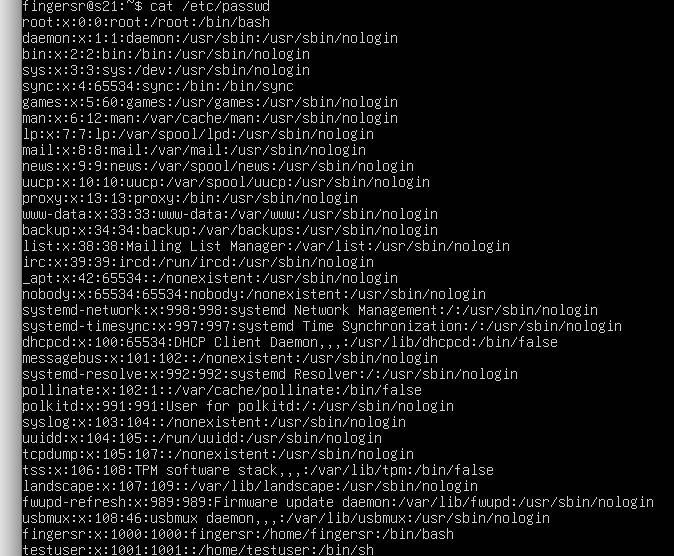

## Part 3. Настройка сети ОС 

- Название машины user-1: sudo hostnamectl set-hostname user-1

- Установка часовой пояса: sudo timedatectl set-timezone Europe/Moscow

- имена сетевых интерфейсов: ip link show

- IP адрес устройства DHCP: ip addr show

- Внешний и внутренний IP адрес: ip route show

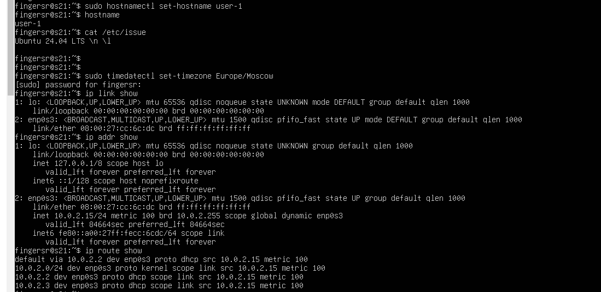

- Настройка конфигурации сети 

- Проверка настройки сети :

ip addr show

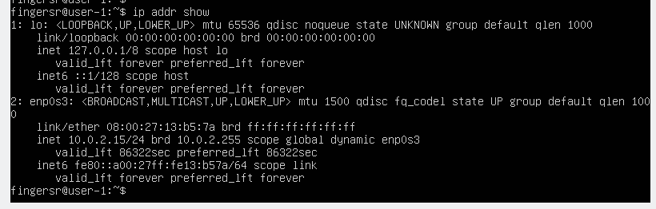

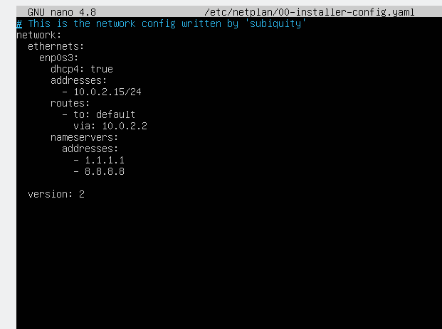

ping -c 4 1.1.1.1

ping -c 4 ya.ru

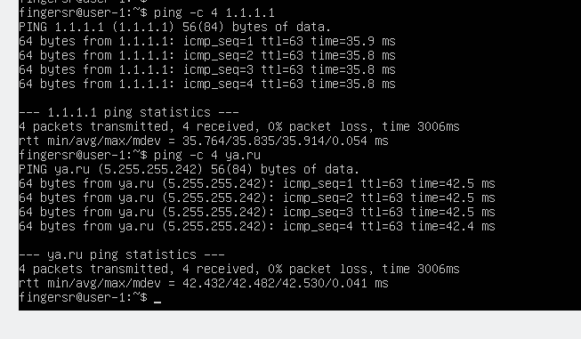

- lo (loopback device) – виртуальный интерфейс, присутствующий по умолчанию в любом Linux. Он используется для отладки сетевых программ и запуска серверных приложений на локальной машине. С этим интерфейсом всегда связан адрес 127.0.0.1. У него есть dns-имя – localhost.

- DHCP (Dynamic Host Configuration Protocol англ.) — протокол динамической настройки узла), позволяющий устройствам автоматически получать IP-адрес, данные о DNS-сервере и другие параметры, необходимые для работы в сети.

## Part4. Обновление ОС

- Обновление системный пакеты: sudo apt update

    sudo apt update -y

- проверка наличий обновлений: sudo apt update

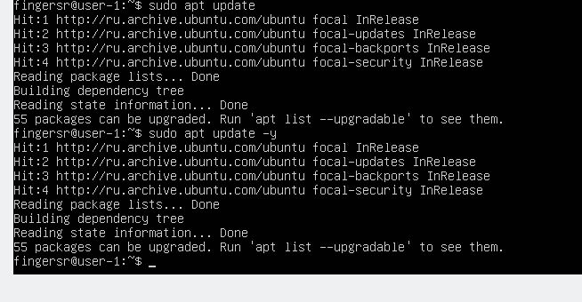

## Part 5. Использование команды sudo

- Разрешение другому пользователя пользоваться правами sudo: sudo usermod -aG sudo new_user

- Изменение имя хоста: sudo hostnamectl set-hostname new-hostname

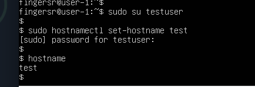

## Part 6. Установка и настройка службы времени

- sudo apt install chrony
- sudo apt install ntp
- timedatectl show | grep NTPSynchronized

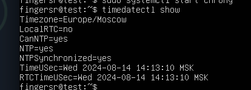

## Part 7. Установка и использование текстовых редакторов 

- Установка vim nano mcedit: sudo apt install vim nano mc

- vim test_vim.txt

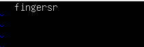

- Сохранить и выйти из VIM: ESC, :, wq и Enter

- nano test_nano.txt

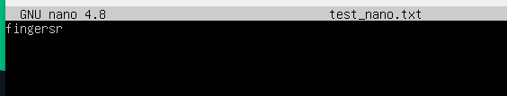

- Сохранить CTRL + O, выйти CTRL + X из NANO

- mcedit test_mc.txt

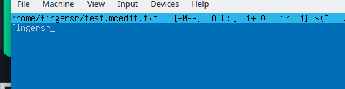

- Сохранить F2, выйти F10 из MCEDIT 

- Замена без сохранений ника на 21 School 21 \

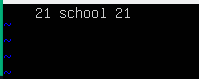

- Выход без сохрания: ESC, : , q! и Enter

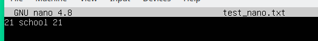

- Выход без сохранения: CTRL + X

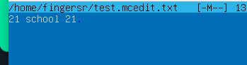

- Выход без сохранения F10

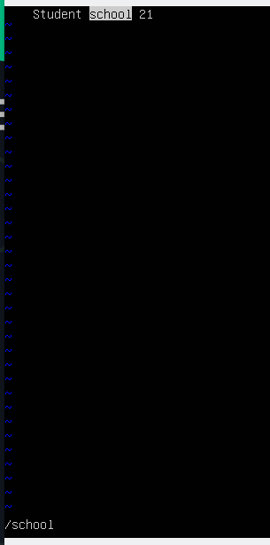
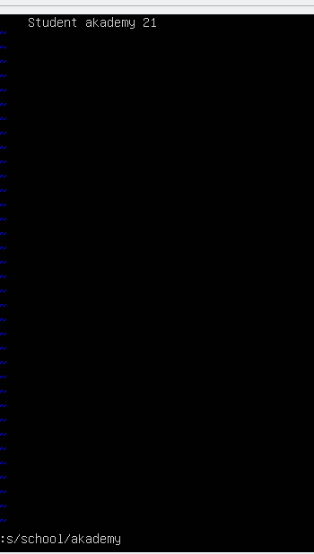

- Поиск слова для vim  ':/find_text'\  
- Замена слово ':s/find_text/replace_text'

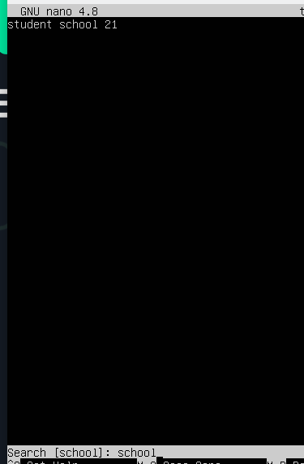
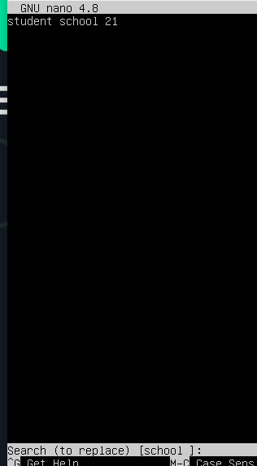

- Поиск слово для nano 'CTRL + w' вводим искомое слово
- Замена слово 'CTRL + \' вводим искомое слово 'enter' вводим замену 'y'

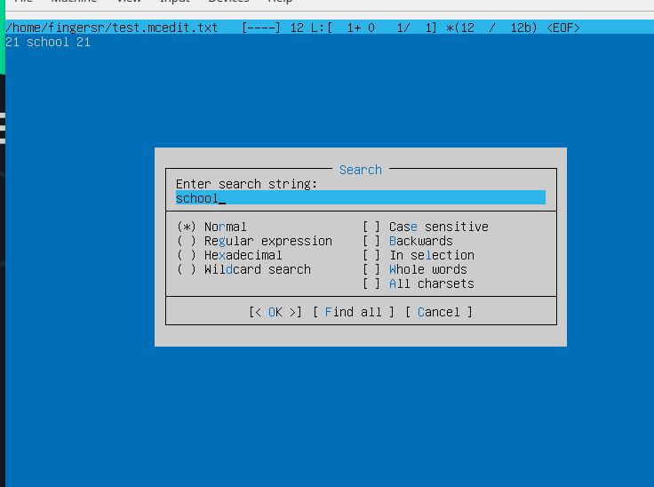
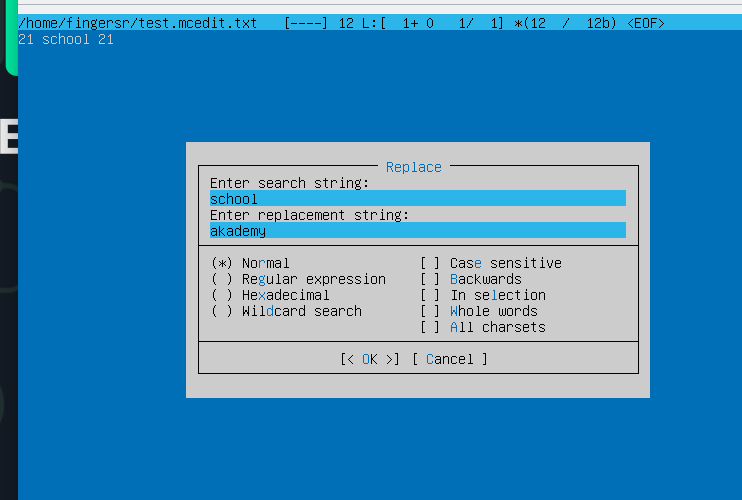

- Для mcedit  поиск 'F7' замена слово 'F4'

## Part 8. Установка и базовая настройка сервиса SSHD

- Установка службы SSHD
    sudo apt update 
    sudo apt install ssh
    sudo apt install openssh-server
- Добавить автостарт службы 
    sudo systemctl enable ssh

- Поменять порт на 2022

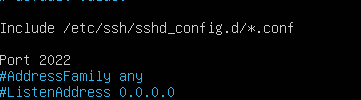

- Наличие процесса sshd: ps -C sshd

ps` - команда, которая выводит статистику и информацию о состоянии процессов в системе, в том числе ИД процесса или нити, объем выполняемого ввода-вывода и используемый объем ресурсов процессора и памяти. 

Список ключей: 

-A, -e, (a) - выбрать все процессы; 

-a - выбрать все процессы, кроме фоновых; 

-d, (g) - выбрать все процессы, даже фоновые, кроме процессов сессий; 

-N - выбрать все процессы кроме указанных; 

-С - выбирать процессы по имени команды; 

-G - выбрать процессы по ID группы; 

-p, (p) - выбрать процессы PID; 

--ppid - выбрать процессы по PID родительского процесса; 

-s - выбрать процессы по ID сессии; 

-t, (t) - выбрать процессы по tty; 

-u, (U) - выбрать процессы пользователя.

- Перезагрузить систему.

      sudo reboot

- Вывод команды netstat -tan

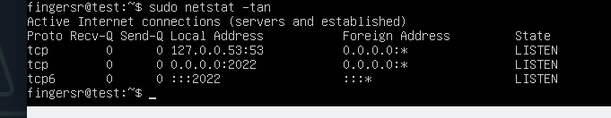

>Вызов команды для вывода списка открытых портов и соответствующих им адресов, таблиц маршрутизации и скрытых соединений. 

Список ключей: 

-t - Отображение текущего подключения в состоянии переноса нагрузки с процессора на сетевой адаптер передаче данных ( "offload" ); 

-a - Отображение всех подключений и ожидающих портов; 

-n - Отображение адресов и номеров портов в числовом формате.

Proto - Протокол, используемый сокетом.

Recv-Q - Счётчик байт не скопированных программой пользователя из этого сокета.

Send-Q - Счётчик байтов, не подтверждённых удалённым узлом.

Local Address - Адрес и номер порта локального конца сокета. Если не указана опция --numeric (-n), адрес сокета преобразуется в каноническое имя узла (FQDN), и номер порта преобразуется в соответствующее имя службы.

Foreign Address - Адрес и номер порта удалённого конца сокета. Аналогично "Local Address."

State - Состояние сокета.

0.0.0.0 -  это немаршрутизируемый адрес IPv4, который используется в качестве адреса по умолчанию или адреса-заполнителя.

## Part 9. Установка и использование утилит top, htop

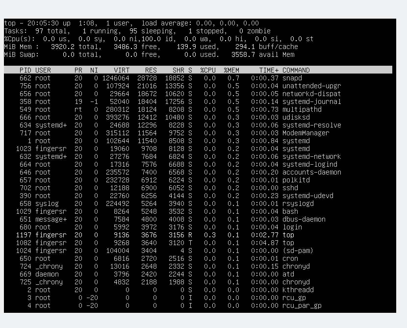
 
 - uptime - 1:08
 - количество авторизованных пользователей - 1
 - общую загрузку системы - 0.00, 0.00, 0.00,
 - общее количество процессов - 97 total,
 - загрузку cpu - 0.0 us,0.0 sy, 0.0 ni, 100.0 id
 - загрузку памяти - 3920.2 total, 3486.3 free, 139.9 used, 294.1 buff/cache
 - pid процесса занимающего больше всего памяти - 662 ,
 - pid процесса, занимающего больше всего процессорного времени - 1082

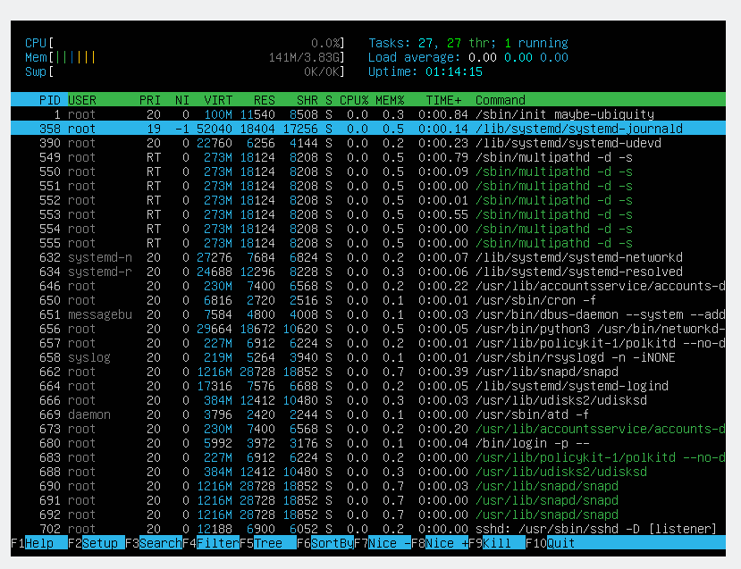
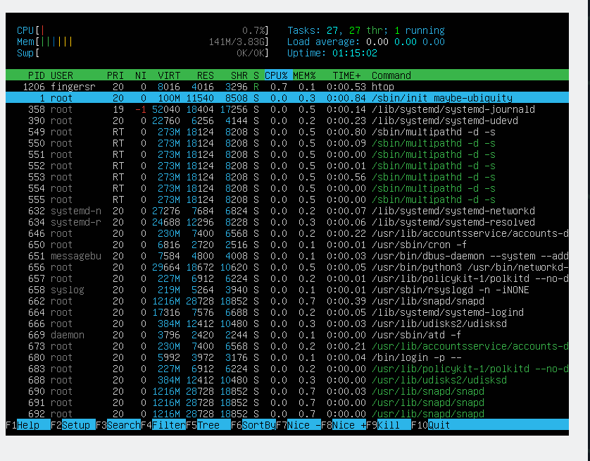
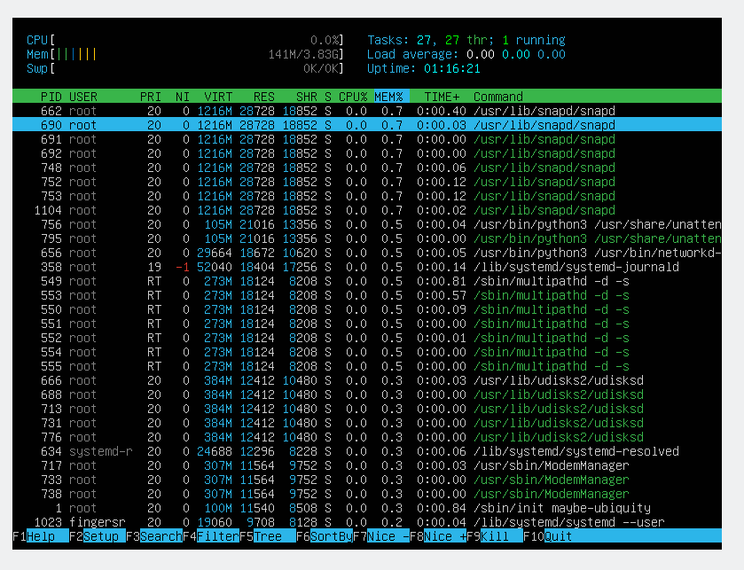
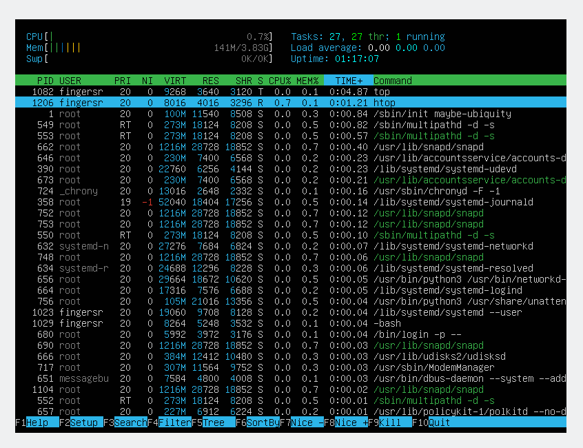
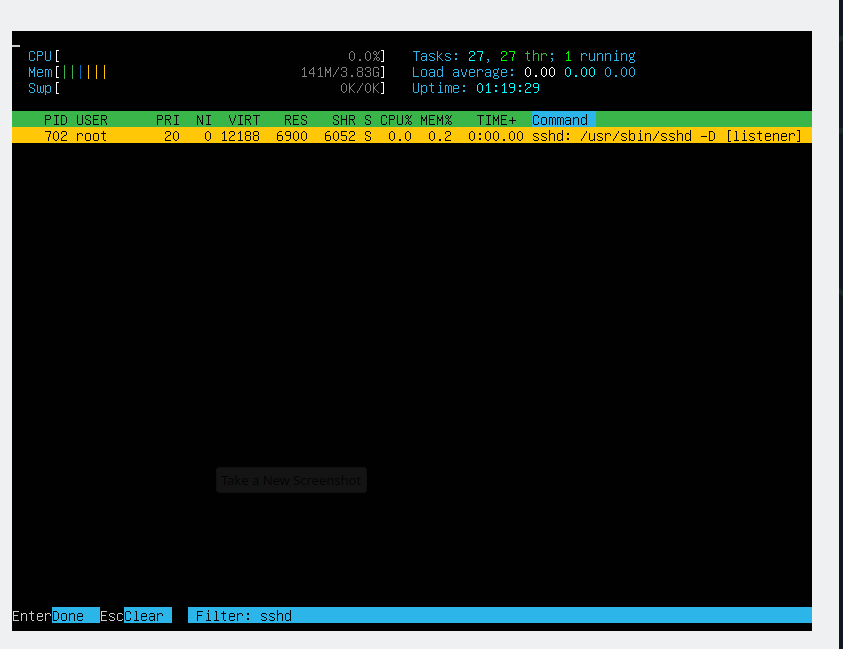
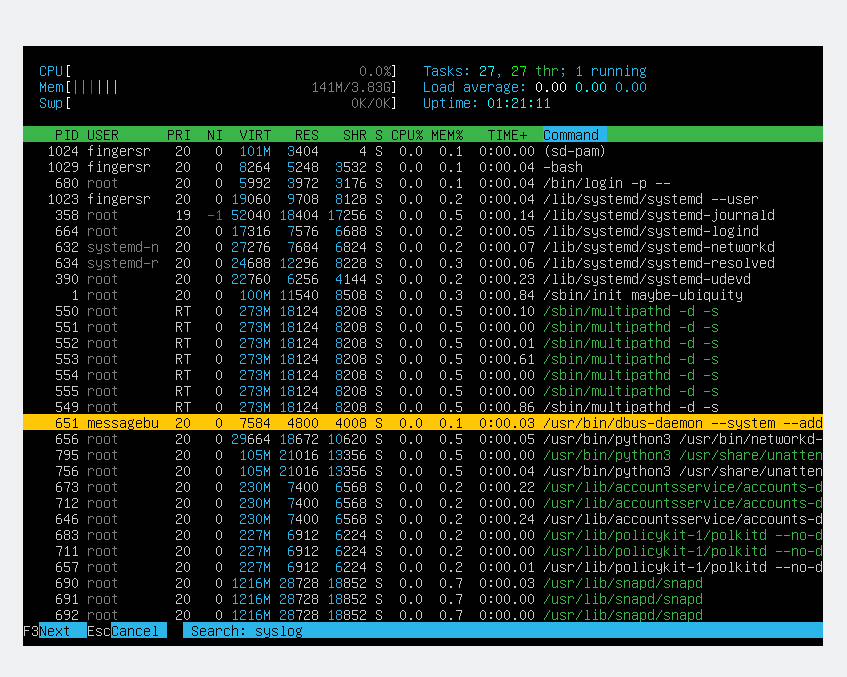
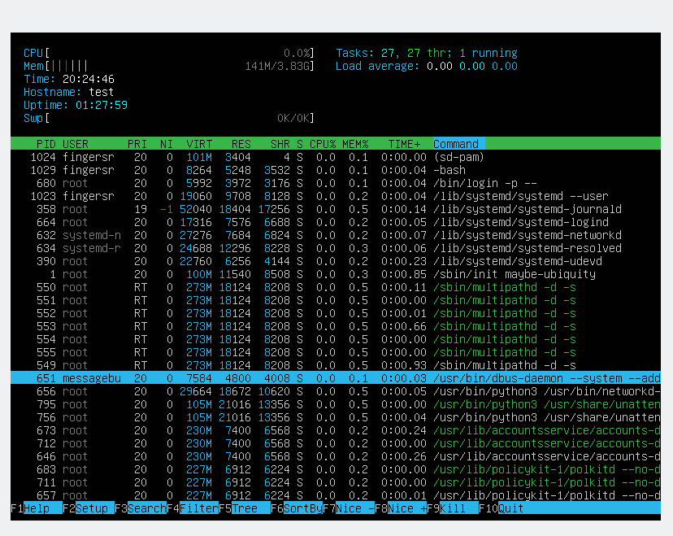

- Через 'F6' выбераем сортирование CPU PID и остальные 

## Part 10. Использование утилиты fdisk 

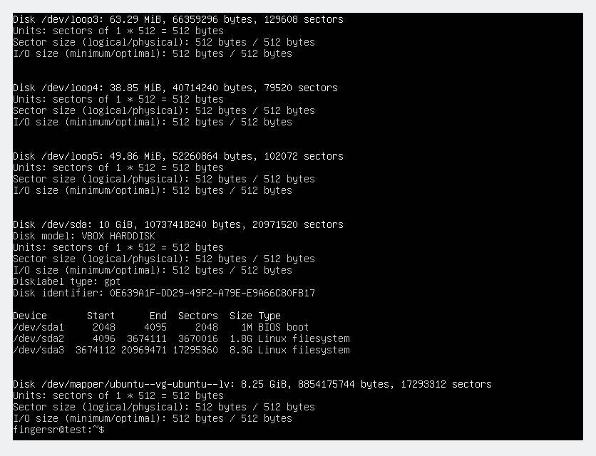

- Посмотреть текушую таблицу разделов: sudo fdisk -l

- Выбрать диск для управления разделами: sudo fdisk /dev/sdX

## Part 11. Использование утилиты df 

- Информация о файловом разделе: df -h

- Информация об определенном файловом раздела: df -h /dev/sdX

- Информация о количестве inodes: df -i

Единица измерения - Килобайт

- Информация о дисковом пространстве читаемом ввиде: df -Th

Единица измерения - Гигабайт

 ## Part 12. Использование утилиты du 

 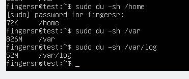

 - Отображуние в удобочитаемом ввиде : 
        - du -sh /home
        - du -sh /var
        - du -sh /var/log

 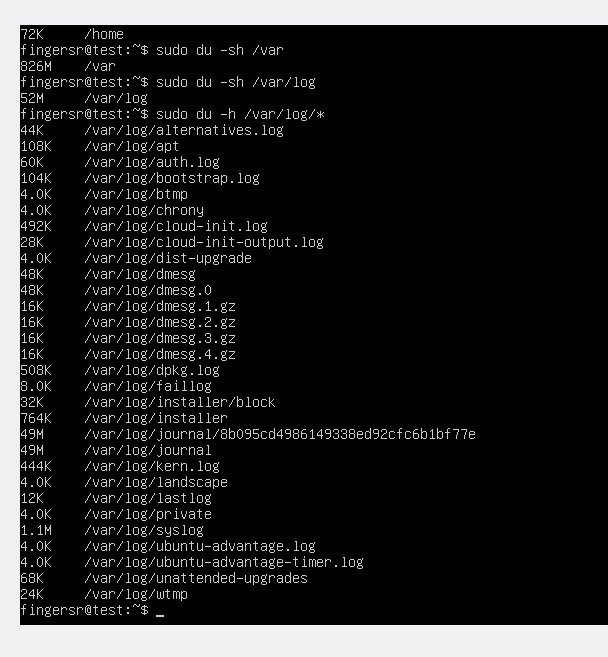

## Part 13. Установка и использование утилиты ncdu 

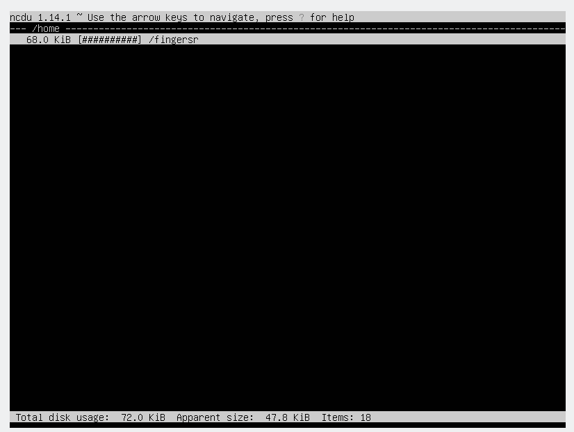
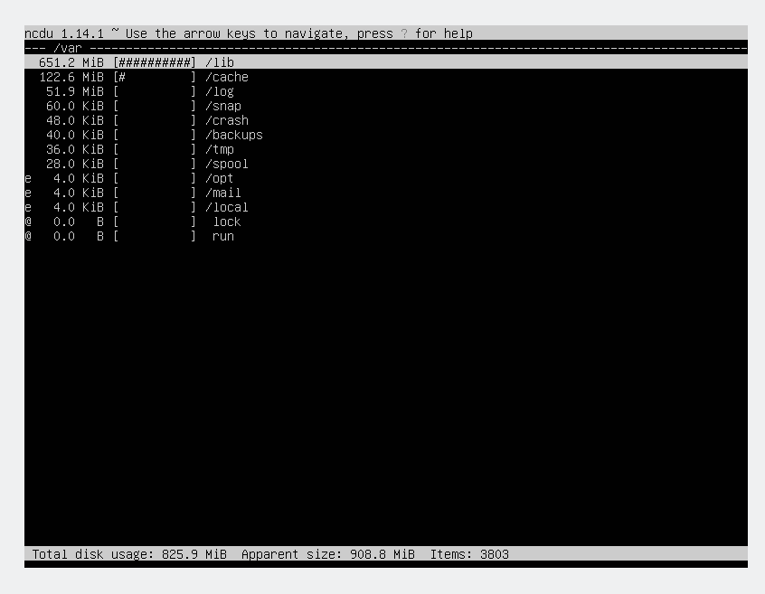
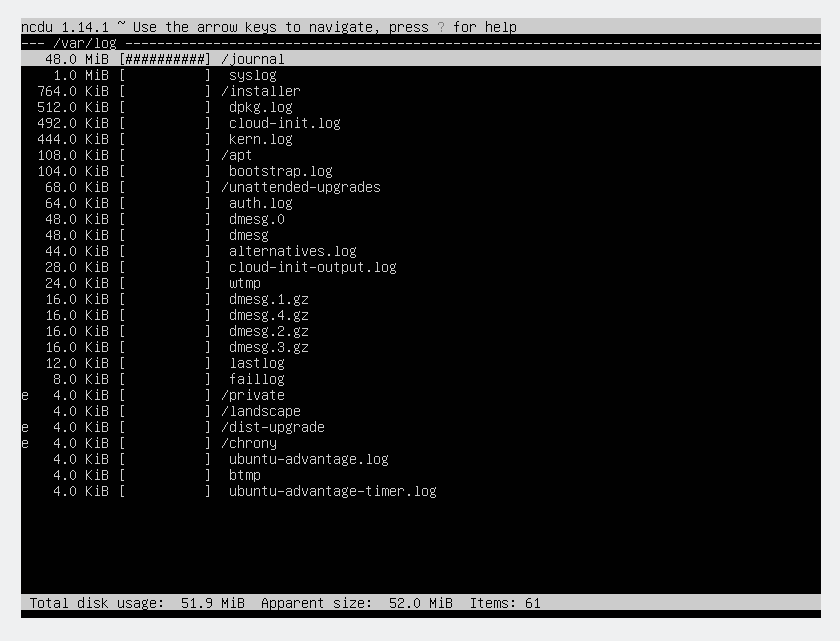

- Установка утилиты: sudo apt install ncdu
    
    - ncdu /home/
    - ncdu /var/
    - ncdu /var/log/

## Part 14. Работа с системными журналами 

- Запуск службы: sudo journalctl
    - просмотр посдених журналов: sudo journalctl -e 
    - просмотр журнала конкретной службы: sudo journalctl -u ssh
    - просмотр логов из файлов: 
        - sudo cat /var/log/syslog
        - sudo cat /var/log/dmesg
        - sudo cat /var/log/auth.log

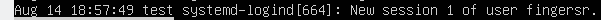
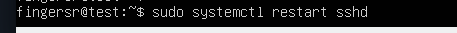
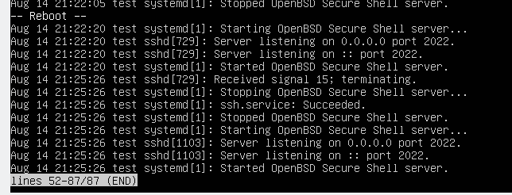

- Перезапустить службу SSHd. 
    -sudo systemctl restart sshd

## Part 15. Использование планировщика заданий CRON 

- Используя планировщик заданий, запустите команду uptime через каждые 2 минуты. 
    - crontab -e

- Редактирование планировщика задач, путем добавления новой строки с текстом */2 * * * * uptime. 
        - Найти в системных журналах строчки (минимум две в заданном временном диапазоне) о выполнении.
- Вывод данных из файла /var/log/syslog со строками о выполнении запуска команды uptime через каждые 2 минуты. 

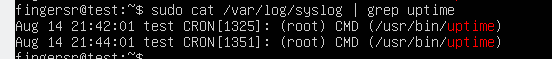

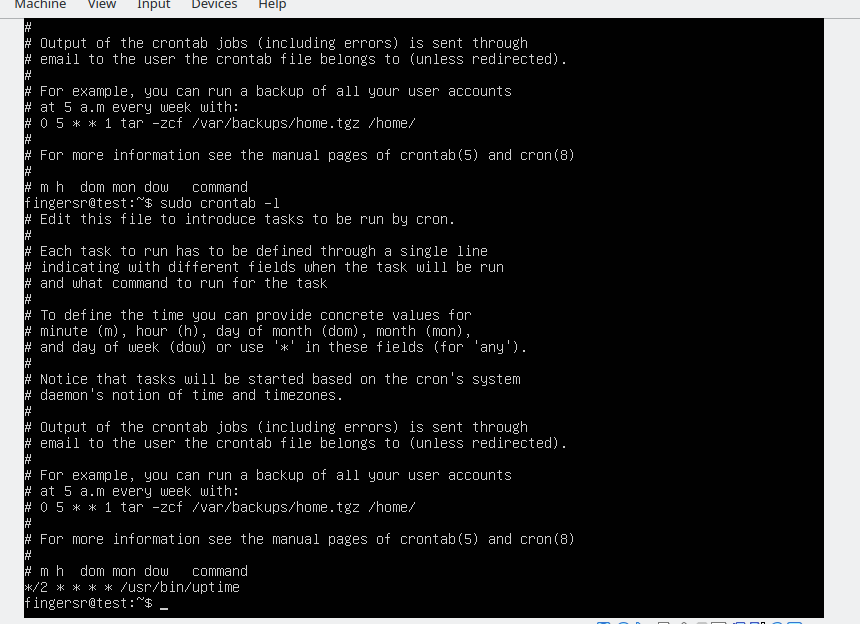

- Вывести на экран список текущих заданий для CRON.

- Удаление всех заданий планировщика и вывод списка текущих заданий для CRON

    - crontab -l
    - crontab -r

    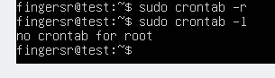