# Part 1. Инструмент **ipcalc**

Запуск ws1 (настроенную в первой части Linux), ssh -p 2022 willumye@127.0.0.1

### 1.1 Маски и сети
- apt install ipcalc

- ipcalc 192.167.38.54/13

    - Адрес сети 192.167.38.54/13 будет равен 192.168.0.0

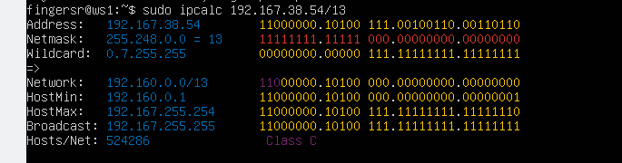

- Перевод маски 255.255.255.0 в префиксную и двоичную запись, /15 в обычную и двоичную, 11111111.11111111.11111111.11110000 в обычную и префиксную
    - Маска: `255.255.255.0` 
        - в префиксной записи `/24`
        - в двоичной записи `11111111.11111111.11111111.00000000`

    - Маска: `/15` 
        - в обычной записи `255.254.0.0` 
        - в двоичной записи `11111111.11111110.00000000. 00000000`

    - Маска: `11111111.11111111.11111111.11110000`
        - в обычной записи `255.255.255.240` (т.к. 1110000 = 240)
        - в префиксной записи `/28` (берем любой IP и подставляем маску в обычной записи)

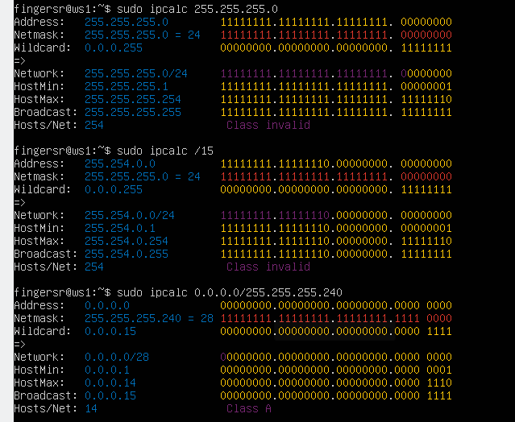

- Минимальный и максимальный хост в сети 12.167.38.4 при масках: /8, 11111111.11111111.00000000.00000000, 255.255.254.0 и /4
    - ipcalc `12.167.38.4/8`
        - минимальный хост `12.0.0.1`
        - максимальный хост `12.255.255.254`
        

    - ipcalc `12.167.38.4/255.255.0.0`
        - минимальный хост `12.167.0.1`
        - максимальный хост `12.167.255.254`

    - ipcalc `12.167.38.4/255.255.254.0`
        - минимальный хост `12.167.38.1`
        - максимальный хост `12.167.39.254`

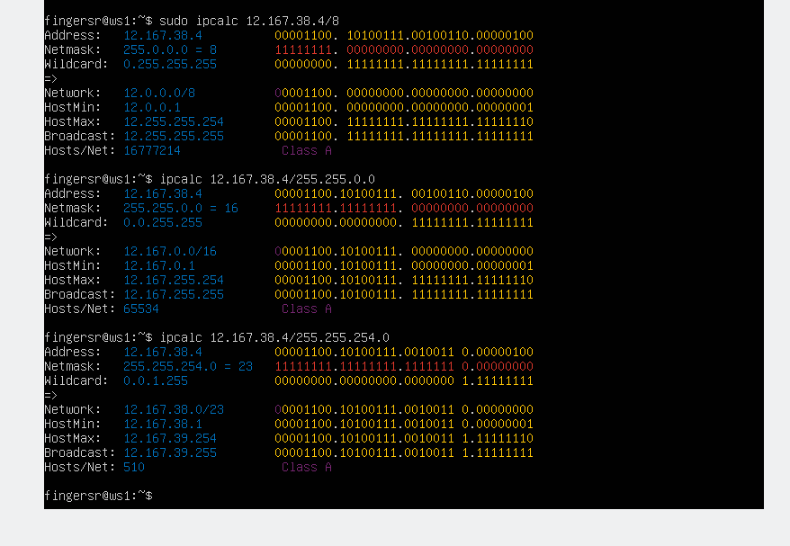

    - ipcalc `12.167.38.4/4`
        - минимальный хост `0.0.0.1`
        - максимальный хост `15.255.255.254`

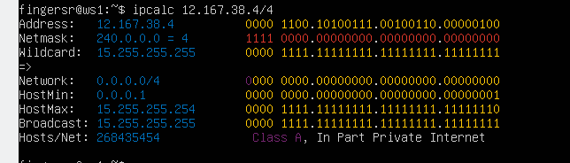

### 1.2 localhost
Определи и запиши в отчёт, можно ли обратиться к приложению, работающему на localhost, со следующими IP: 194.34.23.100, 127.0.0.2, 127.1.0.1, 128.0.0.1
- ipcalc 127.0.0.1 (localhost - loopback IPv4 адрес, указывающий на текущую машину и равный 127.0.0.1)
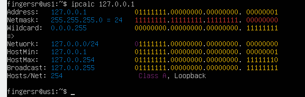
 Как мы видим, диапазон адресов для сегмента, в котором находится localhost равен от `127.0.0.1` до `127.0.0.254`. Следовательно обратиться к нему мы можем ТОЛЬКО с адреса 127.0.0.2, т.к. остальные адреса выпадают из диапазона.

### 1.3 Диапазоны и сегменты сетей
- Какие из перечисленных IP можно использовать в качестве публичного, а какие только в качестве частных: 
    - 10.0.0.45 - private
    
    - 134.43.0.2 - public
    
    - 192.168.4.2 - privatesudo
     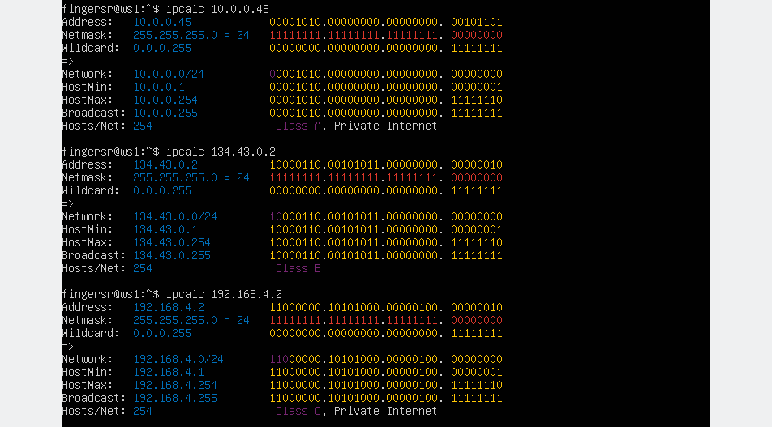
    - 172.20.250.4 - private
    
    - 172.0.2.1 - public
    
    - 192.172.0.1 - public
     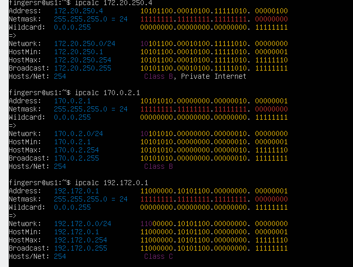
    - 172.68.0.2 - public
    
    - 172.16.255.255 - private
    
    - 10.10.10.10 - private
     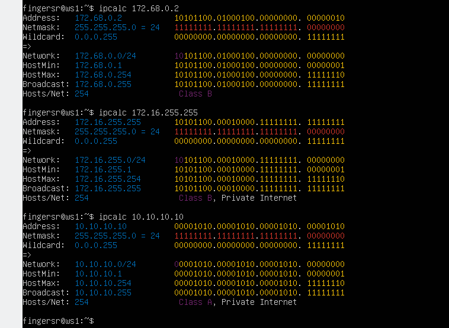
    - 192.169.168.1 - public
     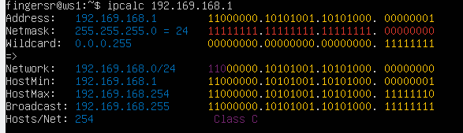

- Какие из перечисленных IP адресов шлюза возможны у сети 10.10.0.0/18: (смотрим диапазон адресов)
    - 10.0.0.1 - нет
    - 10.10.0.2 - да
    - 10.10.10.10 - да
    - 10.10.100.1 - нет
    - 10.10.1.255 - да
 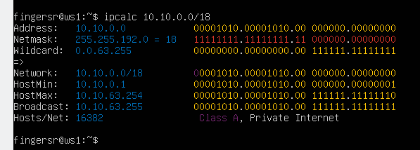

## Part 2. Статическая маршрутизация между двумя машинами

- Поднимаем 2 виртуалки на ubuntu LTS server 22.04 (ws1 и ws2)
 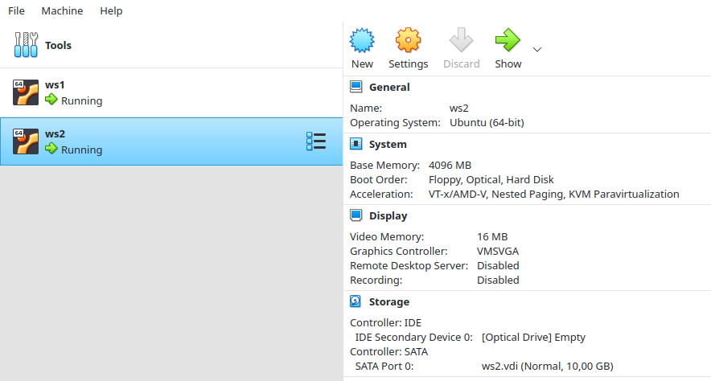
 Перед запуском на каждую машину добавляем по 1 сетевому интерфейсу типа "Внутренняя сеть".
 ВНИМАНИЕ! Имя сети в настройках VB для обеих машин должно быть ОДИНАКОВОЕ, например LAN1!

- Просмотр сетевых интерфейсов: `ip a`
 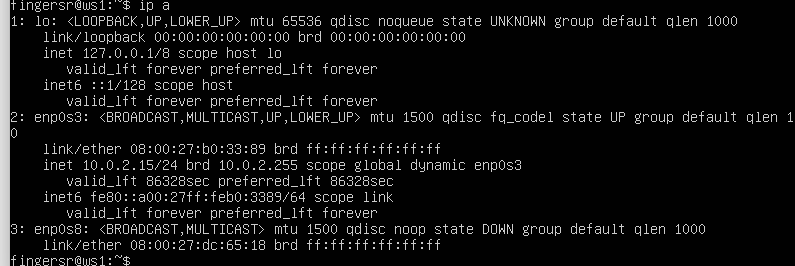
 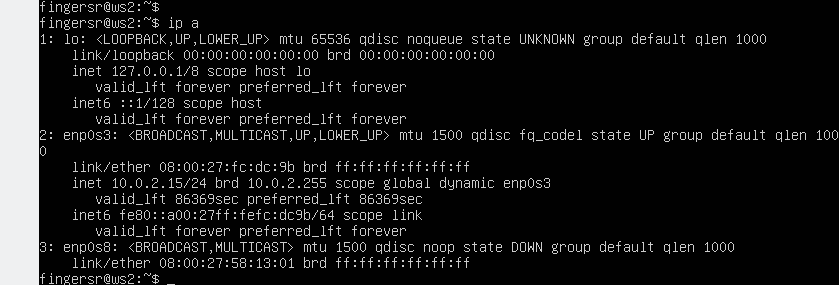
 На скриншотах видим дополнительные интерфейсы enp0s8

- изменяем netplan в соответствии с заданием
 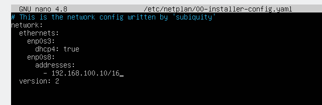
 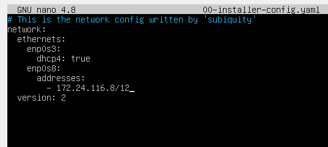
 Применяем netplan apply к каждой машине
 
 

### 2.1 Добавление статического маршрута вручную

- Добавь статический маршрут от одной машины до другой и обратно при помощи команды вида `ip r add`

 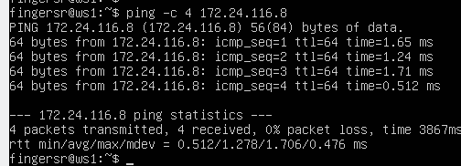
 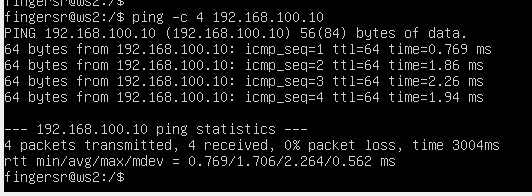

### 2.2 Добавление статического маршрута с сохранением

- Изменение для сохранения маршрутов
 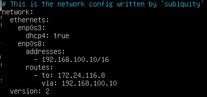
 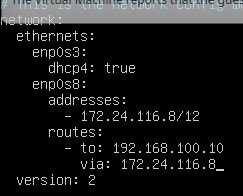
- Чтобы сохранить марштуты на постоянной основе, применим netplan командой: netplan apply

- Проверка
 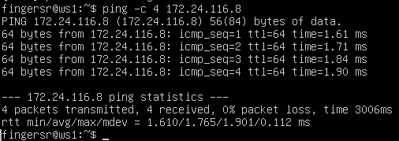
 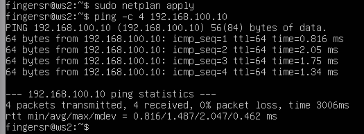

## Part 3. Утилита iperf3
`sudo apt install iperf3`

### 3.1 Скорость соединения
- 8 Mbps = 1 MB/s
- 100 MB/s = 800 000 Kbps
- 1 Gbps = 1000 Mbps

## 3.2 Утилита **iperf3**
> iperf3 - это утилита командной строки для измерения пропускной способности сети между двумя устройствами. Она позволяет оценить скорость передачи данных между клиентским и серверным устройствами
- Запускаем на ws1 в режиме сервера с выводом результата в MB/s: `iperf3 -s -f M`
- Запускаем на ws2 в режиме клиента: `iperf3 -c 192.168.100.10`
 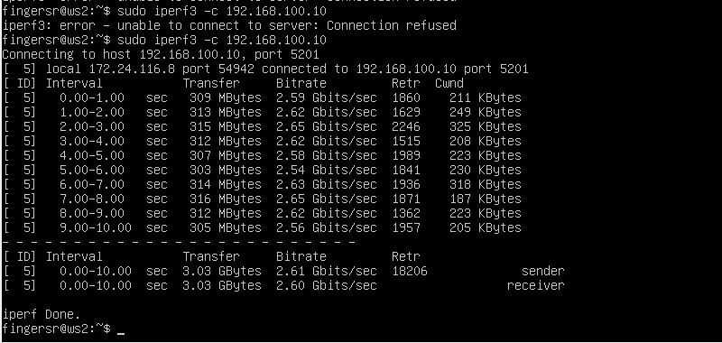
- Результат работы утилиты на ws1:
 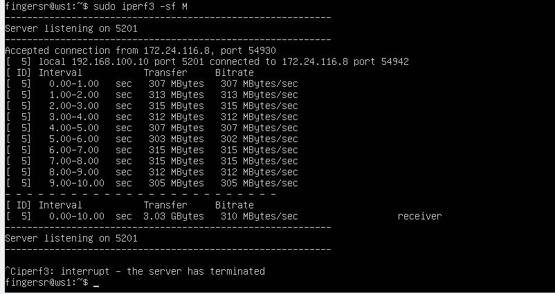
- Скорость соединения между машинами - 310 MB/s

## Part 4. Сетевой экран
### 4.1. Утилита **iptables**
- Создадим файлы `/etc/firewall.sh`, имитирующие фаерволл, на ws1 и ws2:
- Добавим в файлы подряд следующие правила:
  - доступ для порта 22 (ssh) и порта 80 (http)
  - на ws1 сначала запретим echo-reply(ping), затем разрешим:
    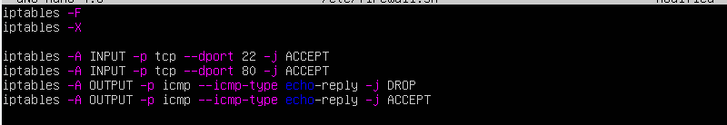
  - на ws2 сначала разрешим echo-reply(ping), затем запретим:
    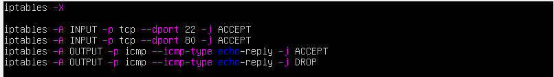
- Запустим файлы на обеих машинах командами `sudo chmod +x /etc/firewall.sh` и `sudo /etc/firewall.sh`
  
  
> Флаг -j в команде iptables используется для указания целевого действия, которое должно быть выполнено, если пакет соответствует заданным условиям в правиле. Так как на машине ws1 первым срабатывает правило `DROP`, то пакет отбрасывается и пинг от ws2 до ws1 не будет работать. Разрешающее правило, которое идет следующим уже не срабатывает. На ws2 первым действием срабатывает `ACCEPT`, пакет принимается и пинг работает.

  ### 4.2 Утилита **nmap**
  - Запускаем команду ping от ws1 до ws2 (пинг работает):
  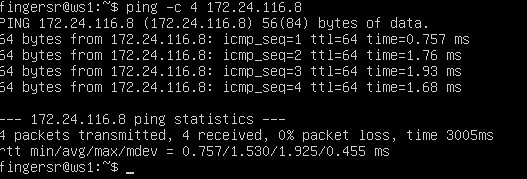
- Запускаем команду ping от ws2 до ws1 (пинг не работает):
  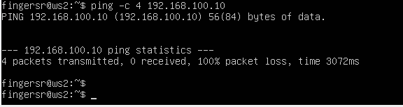
- Запускаем nmap на ws1, вывод показывает, что хост на ws2 работает (Host is up):
  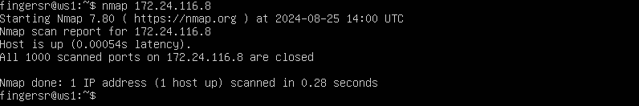
- Запускаем nmap на ws2, вывод показывает, что хост на ws1 работает (Host is up):
  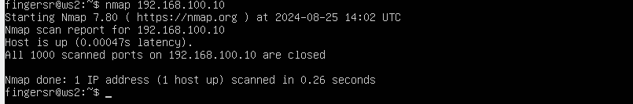
- Сохраним дампы образов виртуальных машин ws1 и ws2:
  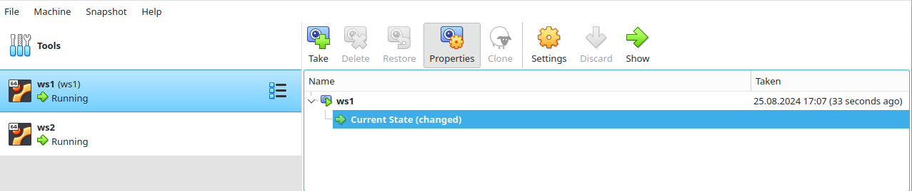

  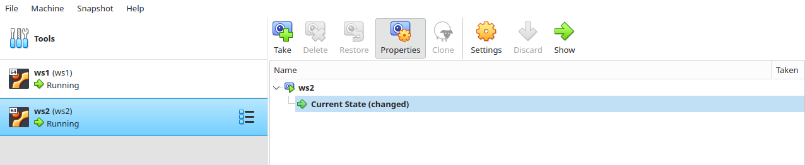

## Part 5. Статическая маршрутизация сети

- Поднимаем пять виртуальных машин (3 рабочие станции (ws11, ws21, ws22) и 2 роутера (r1, r2))
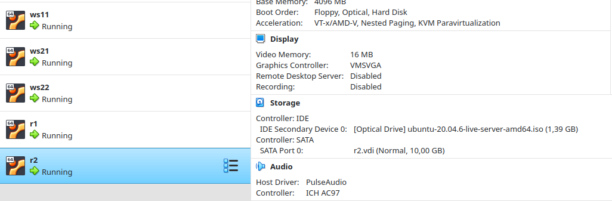

### 5.1 Настройка адресов машин
- Настраиваем конфигурации машин в *etc/netplan/00-installer-config.yaml*:
  - ws11
   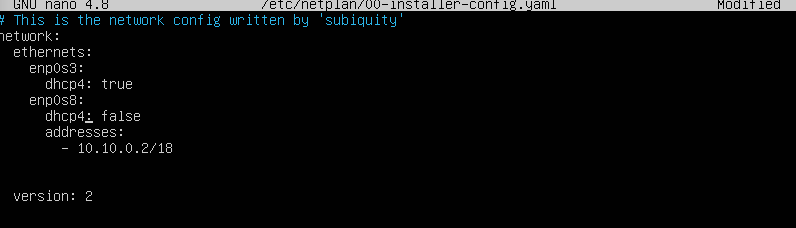
  - r1
   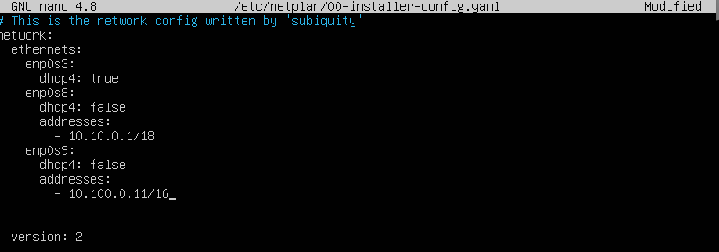
  - r2
   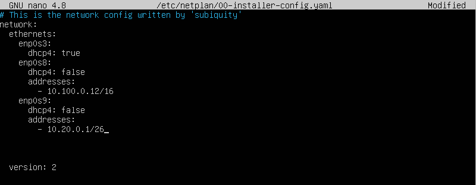
  - ws21
   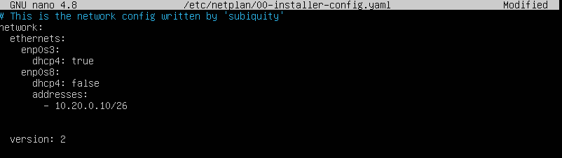
  - ws22
   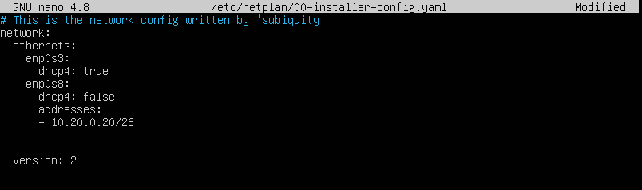
- Перезапускаем сервисы сети на каждой машине и командой `ip -4 a` проверяем, что адреса заданы верно.

- ws11
 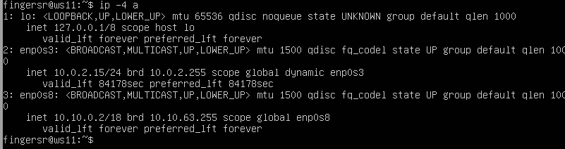
- ws21
 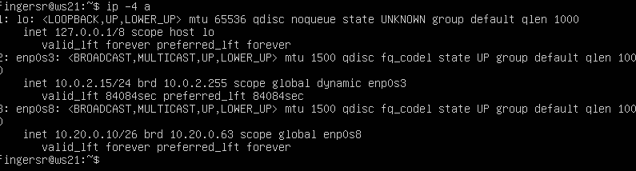
- ws22
 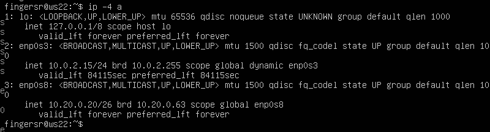
- r1
 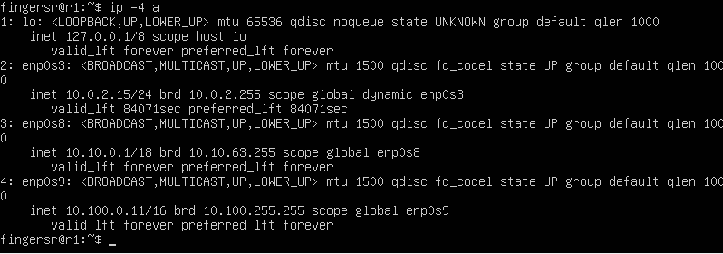
- r2
 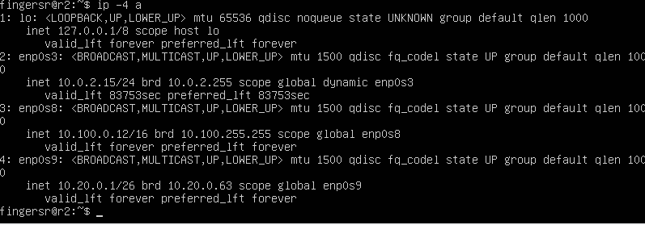
- Пинг ws22 с ws21
 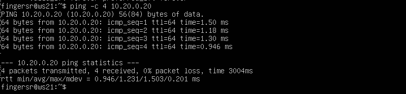
- Пинг r1 с ws11
 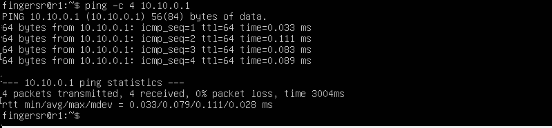

### 5.2 Включение переадресации IP-адресов.
- Для включения переадресации IP, выполним на роутерах команду `sysctl -w net.ipv4.ip_forward=1`:
- r1
 
- r2
 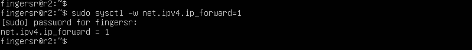

 *При таком подходе переадресация не будет работать после перезагрузки системы.*

- Открываем файл */etc/sysctl.conf* и раскомментируем следующую строку `net.ipv4.ip_forward = 1`:
- r1
 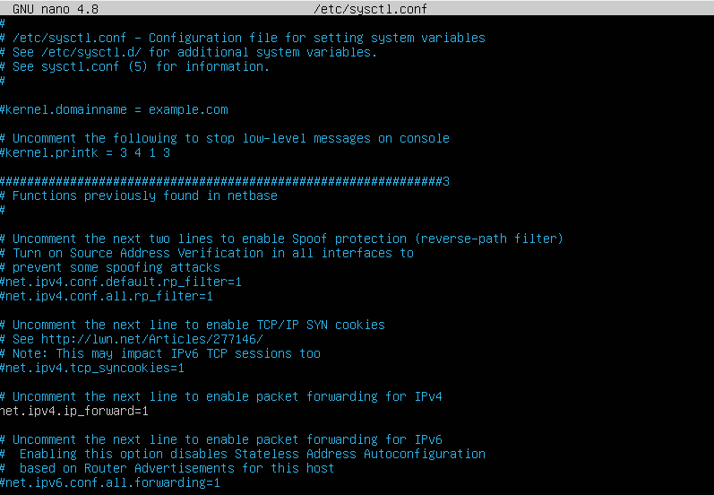
- r2
 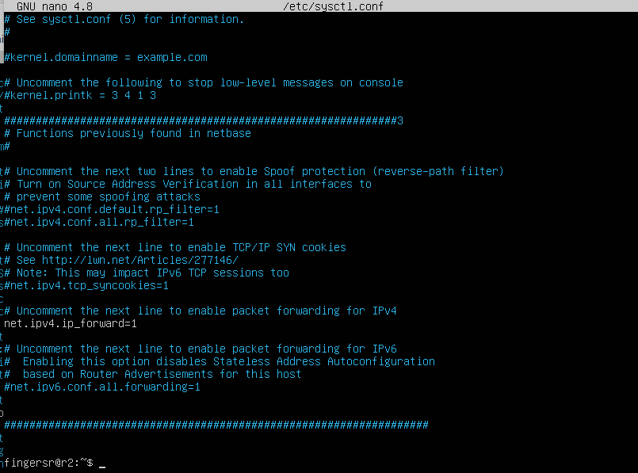
 *При использовании этого подхода, IP-переадресация включена на постоянной основе.*

### 5.3 Установка маршрута по-умолчанию
- Настроим маршрут по-умолчанию (шлюз) для рабочих станций в файле *etc/netplan/00-installer-config.yaml*:
 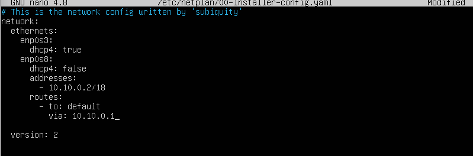
 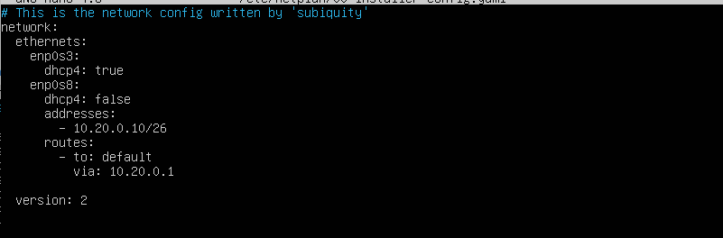
 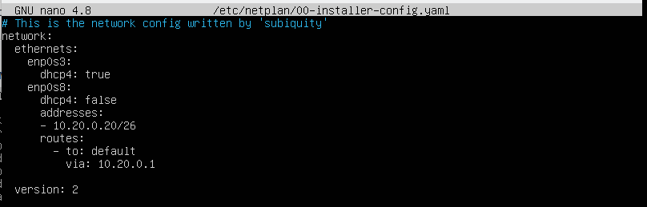
- С помощью команды `ip r` показываем, что добавился маршрут в таблицу маршрутизации:
 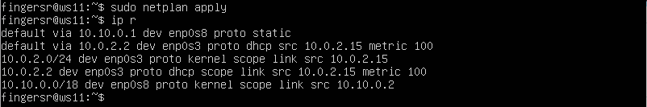
 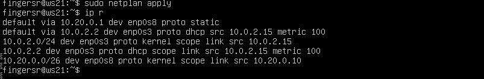
 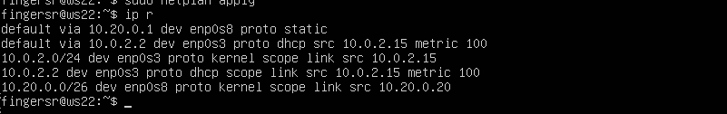
- Пингуем с ws11 роутер r2, с помощью команды `tcpdump -tn -i enp0s8` видим, что пакеты доходят, несмотря на то, что на ws11 написано, что r2 не пингуется:
 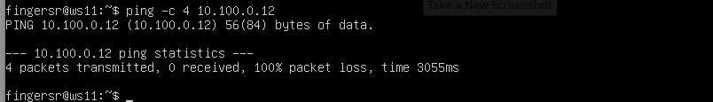
 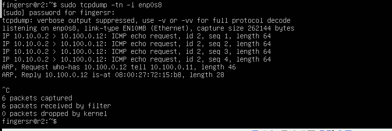

### 5.4 Добавление статических маршрутов
- Добавим в netplan роутеров r1 и r2 статические маршруты
  - r1:
   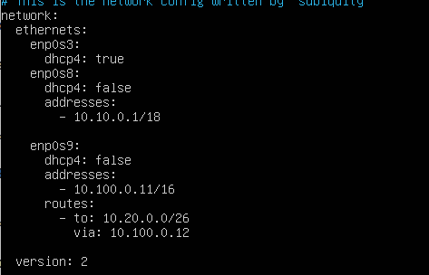
  - r2:
   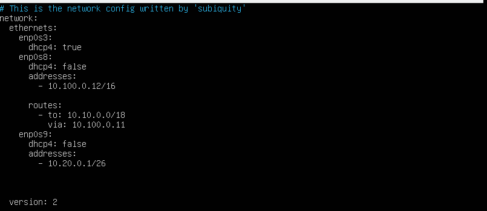
- С помощью команды `ip r` посмотрим таблицы с маршрутами на r1 и r2
  - r1:
   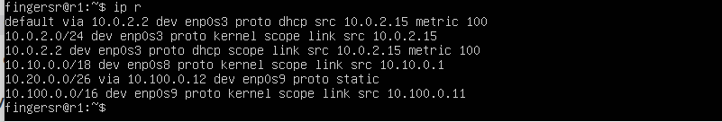
  - r2:
   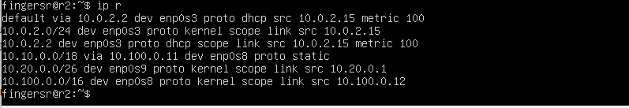
- На ws11 запустим команды `ip r list 10.10.0.0/18` и `ip r list 0.0.0.0/0`
 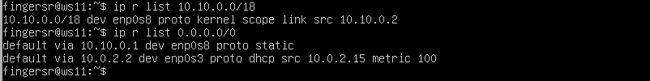
- Из вывода команд видно, что для сети 10.10.0.0/18 был выбран маршрут, отличный от 0.0.0.0/0, хотя он попадает под маршрут по-умолчанию. Это произошло потому, что если есть явный маршрут к подсети, который соответствует адресу назначения, система будет использовать этот маршрут, даже если задан маршрут по-умолчанию (default), так как маршруты к конкретным подсетям имеют более высокий приоритет.

### 5.5 Построение списка маршрутизаторов
- Запустим на r1 команду дампа `tcpdump -tnv -i enp0s8`:
 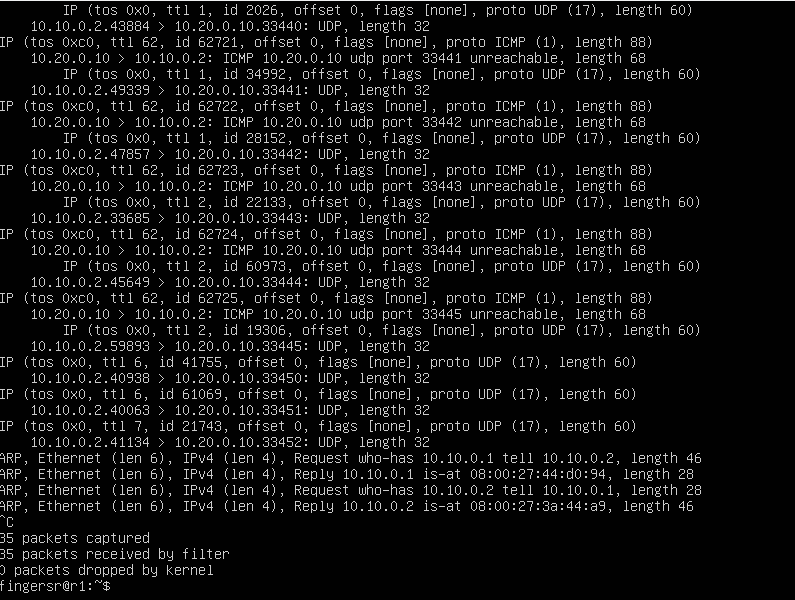
- При помощи утилиты **traceroute** построим список маршрутизаторов на пути от ws11 до ws21:
 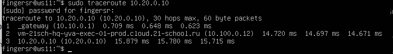
> traceroute - это утилита, которая используется для определения маршрута, который сетевой пакет принимает от отправителя к получателю.
> 1. traceroute отправляет серию сетевых пакетов (обычно 3) к указанному удаленному узлу. Первый пакет отправляется с TTL (Time-To-Live) равным 1.
> 2. Каждый маршрутизатор, через который проходит пакет, уменьшает значение TTL на 1. Если значение TTL достигает нуля, маршрутизатор отбрасывает пакет и отправляет сообщение "Time Exceeded" (время истекло) обратно отправителю.
> 3. traceroute получает это сообщение и записывает IP-адрес маршрутизатора, который обработал пакет с истекшим TTL.
> 4. Затем traceroute отправляет следующий пакет с TTL, увеличенным на 1, чтобы он достиг конкретного маршрутизатора на пути. Повторяется шаг 2 и 3.
> 5. Процесс продолжается до тех пор, пока пакет не достигнет конечного пункта (например, удаленного сервера). Как только это произойдет, traceroute получит ответ от конечного пункта.
> 6. traceroute анализирует все полученные ответы и строит отчет о маршруте, отображая IP-адреса всех промежуточных маршрутизаторов и время задержки (ping) до каждого из них.

### 5.6 Использование протокола **ICMP** при маршрутизации
- Запустим на r1 перехват сетевого трафика, проходящего через enp0s8 с помощью команды `tcpdump -n -i enp0s8 icmp`:
 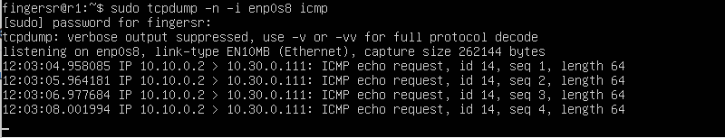
- Пропингуем с ws11 несуществующий IP (например, *10.30.0.111*) с помощью команды `ping -c 1 10.30.0.111`:
 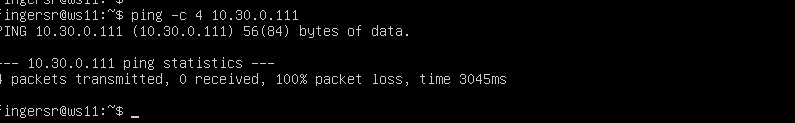
- Сохраним дампы образов виртуальных машин
 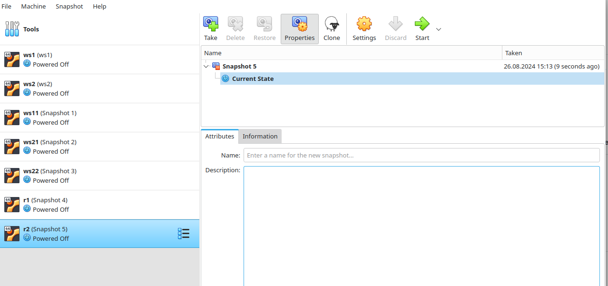

## Part 6. Динамическая настройка IP с помощью **DHCP**
- Установка DHCP сервера `sudo apt install isc-dhcp-server`
- На роутере r2 в файле */etc/dhcp/dhcpd.conf* меняем конфигурацию службы **DHCP** - 
укажем адрес роутера по-умолчанию, DNS-сервер и адрес внутренней сети:
 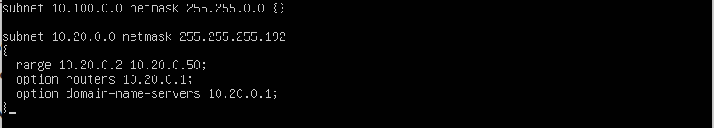
- в файле */etc/resolv.conf* меняем nameserver на `nameserver 8.8.8.8`:
 

- Перезагрузка службы **DHCP** командой `systemctl restart isc-dhcp-server`:
 
- Прописываем на ws21 автоматическое получение адресов
 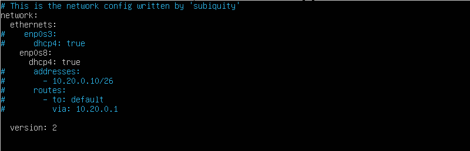
- `netplan apply` на ws21 и через `ip a` проверяем, что она получила новый адрес. Пропингуем ws22 с ws21
 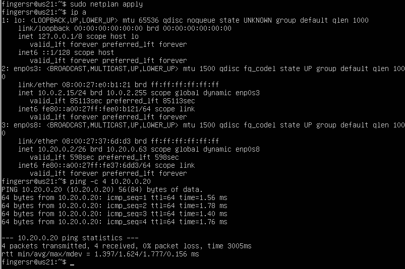

- На ws11 укажем MAC адрес адаптера и автоматическую выдачу адресов
 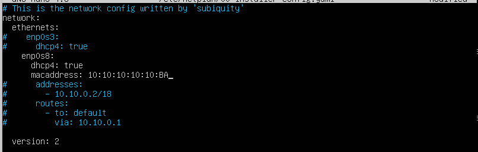
- Для r1 в файле */etc/dhcp/dhcpd.conf* проведем настройку DHCP сервера аналогично r2, но сделаем выдачу адресов с жесткой привязкой к MAC-адресу (ws11)
 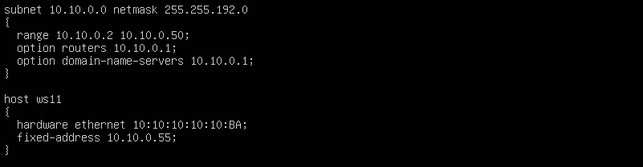
- в файле */etc/resolv.conf* пропишем `nameserver 8.8.8.8`
- Перезагрузим службу **DHCP** командой `systemctl restart isc-dhcp-server`
- Машину ws11 перезагрузим при помощи `reboot` и через `ip a` посмотрим, что она получила адрес
 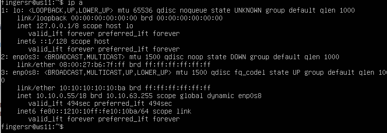
- Пропингуем ws22 с ws11
 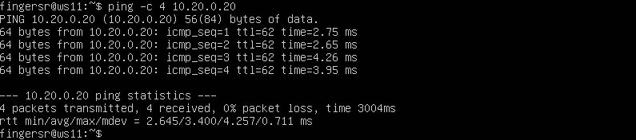

- На машине ws21 запросим обновление ip адреса, команда `sudo dhclient -r` освободит ip-адрес, команда `sudo dhclient` отправит запрос на получение нового адреса у DHCP сервера
 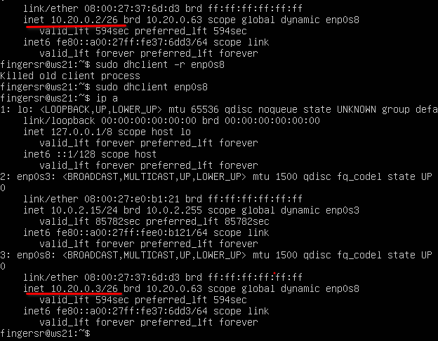
- При настройке **DHCP** сервера использовались опции:
  - subnet: это ключевое слово, которое позволяет определить подсеть и её параметры
  - range: определяет диапазон IP-адресов, который может быть назначен клиентам
  - option routers: задает IP-адрес шлюза по умолчанию
  - option domain-name-servers: определяет DNS-серверы, которые будут предоставляться клиентам
  - host: позволяет назначить опции для конкретного хоста по его MAC-адресу

- Делаем дампы ВМ
 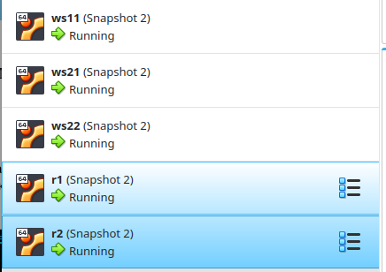

## Part 7. **NAT**

- Установим на машинах сервер Apache2 командой `sudo apt install apache2`
- В файле */etc/apache2/ports.conf* на ws22 и r1 изменим строку `Listen 80` на `Listen 0.0.0.0:80`, то есть сделаем сервер Apache2 общедоступным
 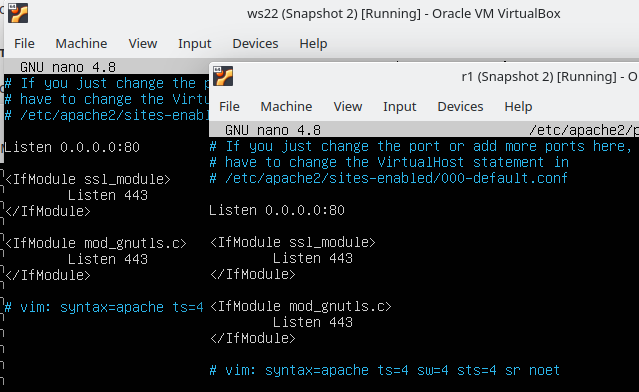

- Запустим веб-сервер Apache командой `service apache2 start` на ws22 и r1

 

 

- Добавим в файл `/etc/firewall.sh`, созданный по аналогии с фаерволом из части 4, на r2 следующие правила:
  - удаление правил в таблице filter - `iptables -F`
  - удаление правил в таблице "NAT" - `iptables -F -t nat`
  - отбрасывать все маршрутизируемые пакеты - `iptables --policy FORWARD DROP`
 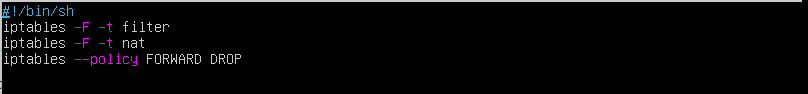
> запустим файл фаервола `/etc/firewall.sh`
- Проверим пинг ws22 с r1. При запуске файла с этими правилами, ws22 не должна пинговаться с r1
 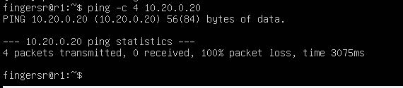
- Добавим в фаервол r2 еще одно правило, разрешающее маршрутизацию всех пакетов протокола ICMP `iptables -A FORWARD -p icmp -j ACCEPT`:
 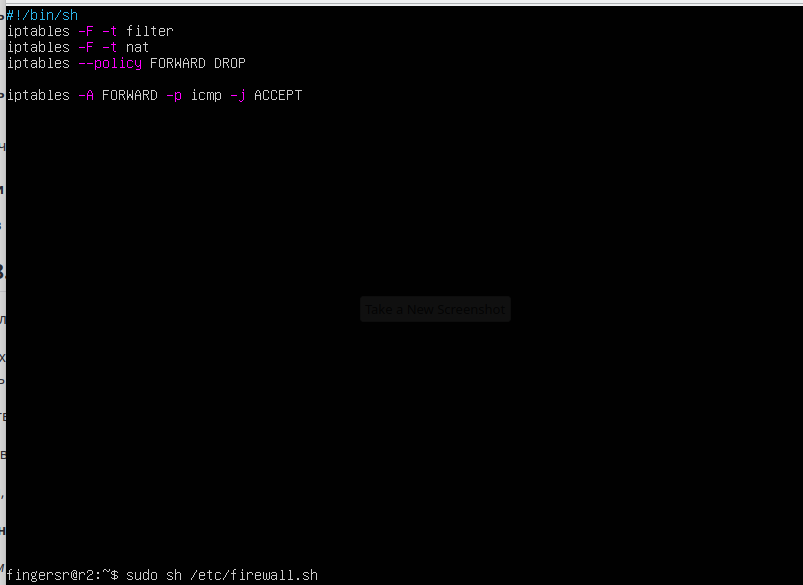
> запустим файл фаервола `/etc/firewall.sh`
- С новым правилом, ws22 должна пинговаться с r1
 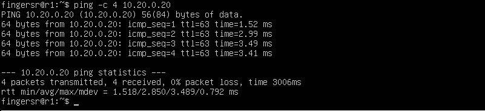
- Добавим в файл ещё два правила:
  - включить **SNAT**, а именно маскирование всех локальных ip из локальной сети, находящейся за r2 (по обозначениям из Части 5 - сеть 10.20.0.0)
  - включить **DNAT** на 8080 порт машины r2 и добавить к веб-серверу Apache, запущенному на ws22, доступ извне сети 
 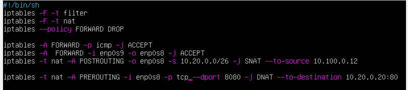
> запустим файл фаервола `/etc/firewall.sh`
- Проверим соединение по TCP для **SNAT**, для этого с ws22 подключимся к серверу Apache на r1 командой `telnet 10.100.0.11 80`
 
- Проверим соединение по TCP для **DNAT**, для этого с r1 подключимся к серверу Apache на ws22 командой `telnet 10.100.0.12 8080` (обращаемся по адресу r2 и порту 8080)
 
- Сохраним дампы образов виртуальных машин
 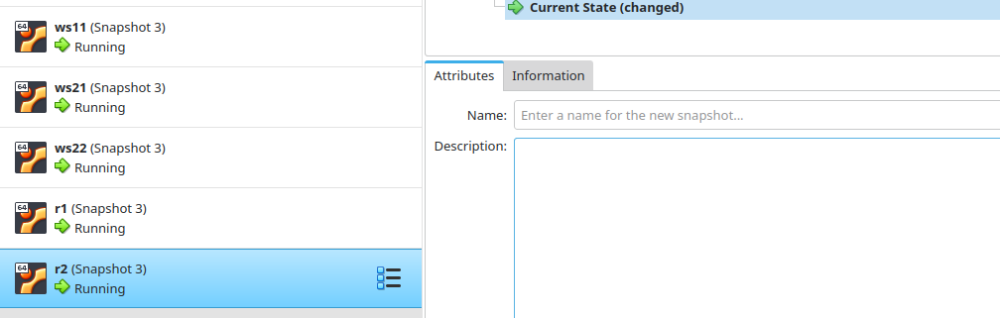

## Part 8. Дополнительно. Знакомство с **SSH Tunnels**

- Запустим на r2 фаервол с правилами из Части 7
 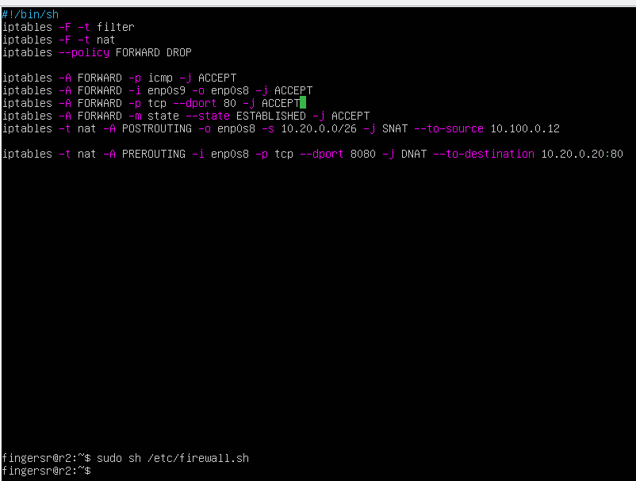
- Запустиv веб-сервер **Apache** на ws22 только на localhost (то есть в файле */etc/apache2/ports.conf* изменим строку `Listen 80` на `Listen localhost:80`)
 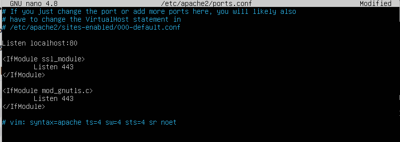
- Используем *Local TCP forwarding* с ws21 до ws22, чтобы получить доступ к веб-серверу на ws22 с ws21
 
 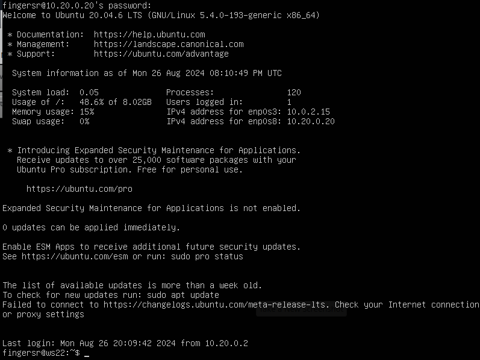
- Воспользуемся *Remote TCP forwarding* c ws11 до ws22, чтобы получить доступ к веб-серверу на ws22 с ws11
 
 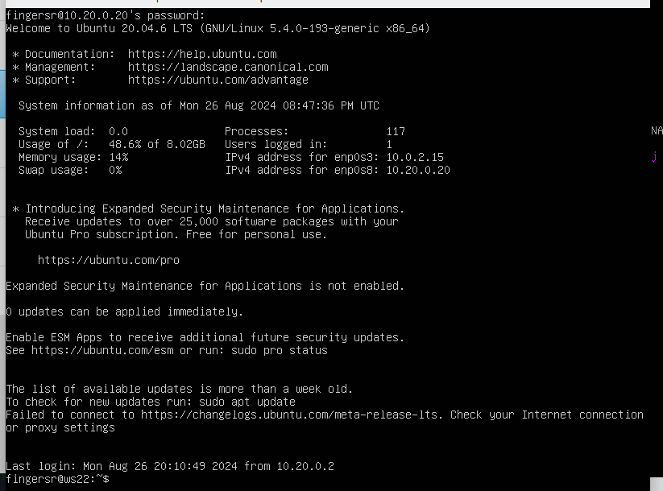
- Для проверки, сработало ли подключение в обоих предыдущих пунктах, перейдите во второй терминал (например, клавишами Alt + F2) и выполните команду:
`telnet 127.0.0.1 [локальный порт]`
  - ws21
 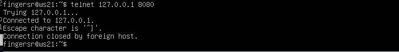
  - ws11
 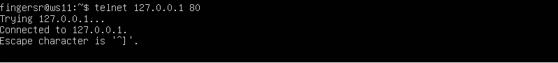

- Сохрани дампы образов виртуальных машин.
 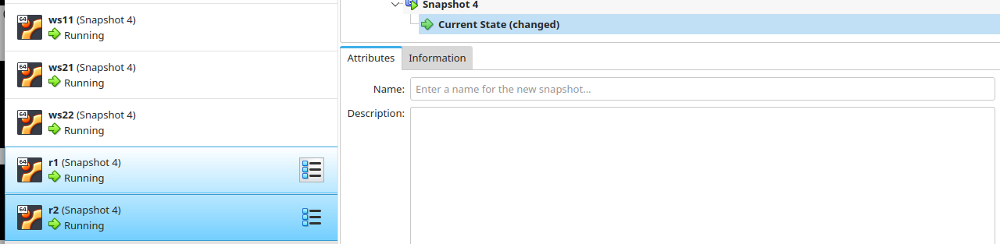